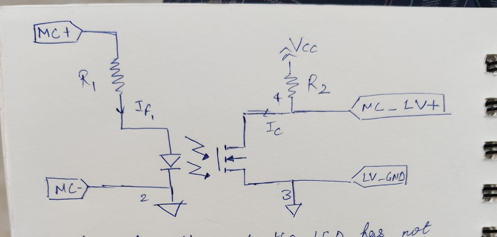

### 1.1)	What is meant by galvanic isolation? Why do you think isolation is crucial for any EV car? 
Ans. Galvanic isolation is a condition between two circuits such that no current flows between them even in extreme conditions ( like a very high potential difference) and that there is no direct electrical (galvanic) connection between them.
Our EV consists of HV circuitry and the LV circuitry and it is very important that these two remain non-interactive so that no harm is caused to the sensitive electronics of the LV system due to disturbances from the HV that may even lead to a short circuit.
Also, the LV grounded to the chassis ( T 11.1.7) so isolating it from the HV prevents rick of electric shock .

1.2)	The given circuit shows a direct path for the current to flow between the High voltage (Tractive System) and the low voltage detection circuitry.
It is not rule compliant as the systems are not galvanically isolated.
According to the rule EV 1.1.1, Tractive System (TS)– **every part that is electrically connected to the motors and TS accumulators. The LVS may be supplied by the TS if a galvanic isolation between both systems is ensured.**
Hence, the motor controllers are a part of the High voltage tractive system and galvanic isolation has not been done in case of the HV and LV in this circuit.
Here, between these two isolated energy transfer is permitted.

1.3)	(i) The insulation monitoring device (IMD) detects an isolation failure in the TS circuit. 
The label on the green light must be ‘TS off’ according to rule 4.10.10 that states: A green indicator light in the cockpit that is easily visible even in bright sunlight and clearly marked with “TS off” must light up if TSAL green light is on.
This green LED lights up when the AIRS are open i.e the accumulator has been isolated from the rest of the car.
According to rule 4.10.3:
**The TSAL itself must have a green light, continuously on, active if and only if the LVS is active and ALL of the following conditions are true: • All AIRs are opened. • The pre-charge relay, see EV5.7.2, is opened. • The voltage at the vehicle side of the AIRs inside the TSAC does not exceed 60VDC or 50VACRMS.**

The label on the red light must be ‘IMD’ as per rule 6.3.8 stating:
A red indicator light in the cockpit that is easily visible from inside and outside the cockpit even in bright sunlight and clearly marked with the lettering “IMD” must light up if and only if the IMD opens the SDC.

(ii) The maximum accumulator voltage is 403.2 V. rule 6.3.3:
 The response value of the IMD must be set to ≥500Ω/V, related to the maximum TS voltage.

(iii) In a case where insulation between the HV and the LV becomes weak, the safety circuit should disconnect the HV source from the rest of the car to prevent risk of short circuit and damage of LV components as well as electric shock to the driver. It should also have a mechanism to tell the driver as well as the people outside the reason behind the TS switching off like using the red and green LEDs.

 

We need to know when the mc has been charged with 95% of maximum TS votage. **Therefore, the voltage drop across the mc when charged would be 0.95*403.2 V  = 380 V.** 
The current for operation of relay (If) is 2mA and we keep R1 such that If = 2mA when the voltage across the mc becomes 380 V. 
Also, the forward voltage drop across the LED would be around 0.9 V as the datasheet tells that it would be 0.9 V at the least at If=5mA.
**The MC_LV+ reading would be equal to Vcc until the relay closes i.e. until the charging of the mc but after charging the relay will close and the reading will suddenly drop to less than 0.6V.**

Ic = 100mA when If = 2mA. Vcc and R2 we will adjust such that Ic remains 100mA and the voltage across the output terminals will drop to less than 0.6 V. This is when we come to know that the mc has been appropriately charged.

   

3.1) No, both the contactors should not be closed at the same time. This would lead to our motor-controller getting directly connected to the high voltage source and a high inrush current can severely damage it. After closing the CON- relay, the pre-charge relay is closed. There exists a pre-charge circuit which gradually charges the mc until 95 % of maximum TS voltage. After this amount of charge in the mc, the pre-charge relay is opened and the CON+ is closed. An appropriate delay would be the time required until the voltage across the mc becomes 95% of max TS voltage. If the pre-charge resistor has value R and the capacitance of our mc is C then the approximate time may be R*C*log(20) as per the differential equation of the charging circuit.

3.2) Yes, HV_reset is a part of our SDC. It is the additional activation logic that can re-activate the tractive system. In a scenario where the TS is de-activated due a switch opening in the SDC, the rule book states that now just closing of any of these parts must not re-activate the TS; instead an additional activation logic is required. This means that after the fault (whether IMD or BOTS) has been reset, the HV_reset logic is still required for completing the SDC and activating the TS.
The rule that it complies is 
**EV 4.11.4 )Closing the SDC by any part defined in EV6.1.2 must not (re-)activate the TS. Additional action must be required.**

3.3) This rule ensures that opening the TSMS directly and physically stops power to the tractive system without any intermediary dependencies. If the TSMS is not placed that way, then any of the components in the way could be short circuited to the HVS and the tractive system may still be energized after opening the TSMS thereby increasing risk of hazards during maintainence or emergency.
Also it could risk increasing the time for the voltage of the HVS to drop below a safe threshold within the desired short time during emergencies. This could lead to a fire and be dangerous for the people that are near the EV at that time.
